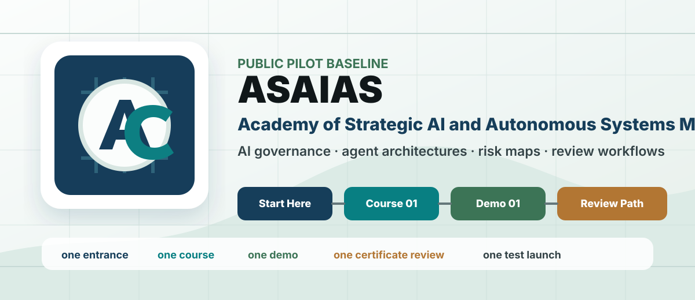
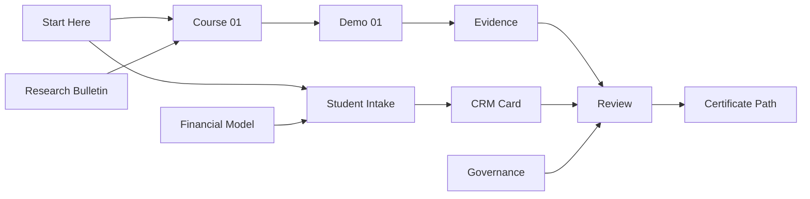

<div align="center">
  

  <h1>ASAIAS</h1>

  <p>
    <strong>Академия стратегического управления искусственным интеллектом и автономными системами</strong>
  </p>

  <p>
    Public pilot для AI governance, autonomous systems, agent architectures,
    risk-aware workflows и AI-native education.
  </p>

  <p>
    <a href="docs/start-here.md"><strong>Start Here</strong></a>
    ·
    <a href="docs/courses/course-01.md">Course 01</a>
    ·
    <a href="demos/demo-01/README.md">Demo 01</a>
    ·
    <a href="docs/certificates/certificate-01.md">Certificate Path</a>
    ·
    <a href="docs/public-roadmap.md">Roadmap</a>
    ·
    <a href="GOVERNANCE.md">Governance</a>
  </p>

  <p>
    
    
    
    
  </p>
</div>

---

## 30-Second Read

ASAIAS is being built as an academy-grade operating system for learning, governing and reviewing AI work. It is not a generic AI content repository: every public artifact should help a student, organization or reviewer move through a concrete route.

```text
one entrance -> one course -> one demo -> evidence -> review -> certificate path
```

The academy expands only after the first student route and the first organization pilot are tested.

## Choose Your Entrance

| If you are... | Open first | What you get |
| --- | --- | --- |
| A new student | [Start Here](docs/start-here.md) | Orientation, first language, course route and application model |
| A manager or founder | [What Academy Sells](docs/finance/what-academy-sells.md) | Clear offer boundaries, buyer logic and pilot framing |
| An organization | [Launch Logistics Model](docs/launch-logistics-model.md) | Test cohort, CRM route and pilot sequence |
| A researcher | [Research Bulletin 001](docs/bulletins/research-bulletin-001.md) | First research note and evidence discipline |
| A developer or contributor | [Contributing](CONTRIBUTING.md) | Branch, pull request, checks and review workflow |
| A public-source reviewer | [Source Map](docs/source-map.md) | What claims are supported and what is still pending |

## Academy Operating System



## Flagship Route

| Layer | Artifact |
| --- | --- |
| Identity | [Academy Identity](docs/academy-identity.md) |
| Entry | [Start Here](docs/start-here.md) |
| Course | [AI Management and Autonomous Systems Foundations](docs/courses/course-01.md) |
| Demo | [AI-Native Operating System Map](demos/demo-01/README.md) |
| Certificate | [Certificate Review Path](docs/certificates/certificate-01.md) |
| Research | [Research Bulletin 001](docs/bulletins/research-bulletin-001.md) |
| Roadmap | [Public Roadmap](docs/public-roadmap.md) |
| Finance | [Financial Model Map](docs/finance/financial-model-map-v1.md) |
| Intake | [Student Intake Form](docs/intake/student-intake-form-v1.md) |

## What ASAIAS Covers

- strategic AI management;
- autonomous systems and agent architectures;
- AI governance, risk maps and review workflows;
- trust, safety and verification;
- human-in-the-loop and human responsibility;
- RAG, knowledge systems and research briefings;
- AI-native education and institutional design;
- private AI infrastructure, consent and safety architecture as a research direction.

## Current Public Surface

| Area | Status | Link |
| --- | --- | --- |
| Academy baseline | Ready for review | [Start Here](docs/start-here.md) |
| Course 01 | Draft baseline | [Course 01](docs/courses/course-01.md) |
| Demo 01 | Draft baseline | [Demo 01](demos/demo-01/README.md) |
| Certificate route | Draft baseline | [Certificate 01](docs/certificates/certificate-01.md) |
| Pricing logic | Draft baseline | [Pricing Draft](docs/finance/pricing-page-draft.md) |
| Open-source media notes | Indexed notes | [Open-Source Media](docs/open-source-media/index.md) |
| Static site assets | Local staging | [Site Blueprint](docs/site-blueprint-v1.md) |

## Repository Map

```text
README.md                  public academy showcase
BRAND_BOOK.md              brand and visual rules
GOVERNANCE.md              decision and review rules
CONTRIBUTING.md            contribution and PR workflow
docs/start-here.md         first entrance
docs/courses/              learning programs
docs/certificates/         review and certificate model
docs/finance/              offer, payment and financial model
docs/intake/               student intake and CRM schema
docs/milestones/           launch milestones
docs/open-source-media/    indexed public notes on personal AI infrastructure
demos/                     learning demonstrations
site/assets/               README and website visual assets
```

## Launch Discipline

The academy does not scale into dozens of courses before the baseline route is tested. The first launch is intentionally narrow:

```text
one entrance
one course
one demo
one certificate review path
one research bulletin
one financial model
one student route
one CRM route
one test launch
```

## Public Boundaries

ASAIAS does not currently claim:

- official, state or accredited status;
- confirmed external partnerships;
- guaranteed income, employment or outcomes;
- automatic certificate approval after payment;
- legal, medical, tax or investment advice.

Allowed public language: **educational and research initiative**, **public pilot**, **project baseline**, **AI governance and autonomous systems education**, **academy as knowledge operating system**.

## Work With The Repository

```text
branch -> pull request -> checks -> review -> merge
```

GitHub access must stay project-local and isolated. See [GitHub Access Policy](docs/github-access-policy.md) and [Local GitHub Wrapper](docs/github-local-wrapper.md).

## Quick Links

- [Academy Identity](docs/academy-identity.md)
- [Source Map](docs/source-map.md)
- [Open-Source Media](docs/open-source-media/index.md)
- [Site Blueprint](docs/site-blueprint-v1.md)
- [Communication Channels](docs/communication-channels-v1.md)
- [What Academy Sells](docs/finance/what-academy-sells.md)
- [Pricing Draft](docs/finance/pricing-page-draft.md)
