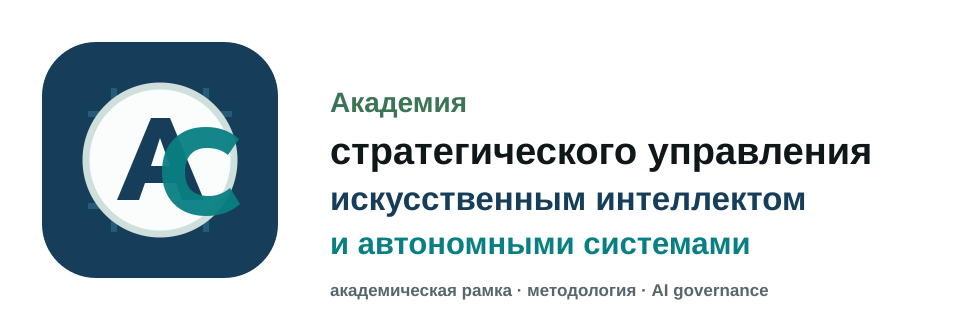

<div align="center">
  

  <h1>ASAIAS</h1>

  <p>
    <strong>Академия стратегического управления искусственным интеллектом и автономными системами</strong>
  </p>

  <p>
    Образовательная, исследовательская и методологическая среда для AI governance,
    автономных систем, агентных архитектур и ответственного внедрения ИИ.
  </p>

  <p>
    <a href="docs/start-here.md"><strong>Начать здесь</strong></a>
    ·
    <a href="docs/courses/course-01.md">Первый курс</a>
    ·
    <a href="demos/demo-01/README.md">Первое demo</a>
    ·
    <a href="docs/public-roadmap.md">Roadmap</a>
    ·
    <a href="GOVERNANCE.md">Governance</a>
  </p>
</div>

---

## Статус

**Public pilot baseline.** Репозиторий фиксирует академическую основу запуска до регистрации юридического лица, аккредитации, внешних партнерств и масштабирования.

ASAIAS сейчас собирается как проверяемая система:

```text
один вход -> один курс -> одно demo -> одна работа -> review -> certificate path
```

Расширение начинается только после тестового маршрута для одного студента и одного организационного пилота.

## Что это

ASAIAS проектируется как академия нового типа: не витрина про "ИИ вообще", а рабочая среда для людей и команд, которым нужно понимать, проектировать, проверять и управлять ИИ-системами.

Ключевые направления:

- strategic AI management;
- autonomous systems and agent architectures;
- AI governance, risk maps and review workflows;
- trust, safety and verification;
- human-in-the-loop and human responsibility;
- AI-native education and institutional design;
- RAG, knowledge systems and research briefings.

## Для кого

- руководители, founders и product owners;
- AI managers, analysts и researchers;
- engineers, переходящие к agentic systems;
- преподаватели и academy builders;
- governance, public sector и institutional teams;
- организации, которым нужен понятный маршрут от обучения к проверяемому pilot.

## Первый академический маршрут

| Слой | Артефакт |
| --- | --- |
| Вход | [Start Here](docs/start-here.md) |
| Курс | [AI Management and Autonomous Systems Foundations](docs/courses/course-01.md) |
| Demo | [AI-Native Operating System Map](demos/demo-01/README.md) |
| Сертификат | [Certificate Review Path](docs/certificates/certificate-01.md) |
| Research | [Research Bulletin 001](docs/bulletins/research-bulletin-001.md) |
| Roadmap | [Public Roadmap](docs/public-roadmap.md) |
| Финансы | [Financial Model Map](docs/finance/financial-model-map-v1.md) |
| Intake | [Student Intake Form](docs/intake/student-intake-form-v1.md) |

## Карта репозитория

```text
README.md                  публичная карточка Академии
BRAND_BOOK.md              бренд и визуальные правила
GOVERNANCE.md              правила принятия решений
CONTRIBUTING.md            вклад, issues, pull requests
docs/start-here.md         первый вход
docs/courses/              учебные программы
docs/certificates/         модель проверки и сертификата
docs/finance/              финансовая модель и платежный контур
docs/intake/               заявки и CRM-схема
docs/milestones/           запусковые этапы
demos/                     учебные демонстрации
site/assets/               публичные визуальные материалы README
```

## Принцип запуска

Академия не расползается в десятки курсов до проверки базового маршрута. Сначала собирается минимальная управляемая система:

```text
один вход
один курс
одно demo
один certificate review path
один research bulletin
одна financial model
один student route
один CRM route
один test launch
```

## Честные ограничения

ASAIAS пока не заявляет:

- официальный или государственный статус;
- аккредитацию;
- подтвержденные внешние партнерства;
- гарантированный доход, работу или результат;
- автоматическую выдачу сертификата после оплаты;
- юридические, медицинские, налоговые или инвестиционные рекомендации.

Допустимый публичный язык: **educational and research initiative**, **public pilot**, **project baseline**, **AI governance and autonomous systems education**, **academy as knowledge operating system**.

## Работа с репозиторием

Проект ведется через понятный академический workflow:

```text
branch -> pull request -> checks -> review -> merge
```

GitHub-доступ должен оставаться проектным и локально изолированным. Правила: [GitHub Access Policy](docs/github-access-policy.md) и [Local GitHub Wrapper](docs/github-local-wrapper.md).

## Быстрые ссылки

- [Academy Identity](docs/academy-identity.md)
- [Source Map](docs/source-map.md)
- [Site Blueprint](docs/site-blueprint-v1.md)
- [Communication Channels](docs/communication-channels-v1.md)
- [What Academy Sells](docs/finance/what-academy-sells.md)
- [Pricing Draft](docs/finance/pricing-page-draft.md)
